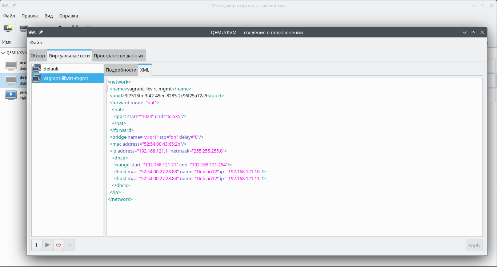

### Advanced Packaging Tool
Advanced Packaging Tool – набор утилит для управления программными пакетами в операционных системах основанных на Debian.

Цель работы:
  - собрать свой APT пакет;
  - cоздать свой репозиторий и разместить там ранее собранный пакет.

#### Подготовка окружения
В нашем примере используется гипервизор Qemu-KVM, библиотека Libvirt. В качестве хостовой системы - OpenSuse Leap 15.5. Автоматическое разворачивание стенда осуществляется с помощью Vagrant.

Для работы Vagrant с Libvirt установлен пакет vagrant-libvirt:
```
Сведения — пакет vagrant-libvirt:
---------------------------------
Репозиторий            : Основной репозиторий
Имя                    : vagrant-libvirt
Версия                 : 0.10.2-bp155.1.19
Архитектура            : x86_64
Поставщик              : openSUSE
Размер после установки : 658,3 KiB
Установлено            : Да
Состояние              : актуален
Пакет с исходным кодом : vagrant-libvirt-0.10.2-bp155.1.19.src
Адрес источника        : https://github.com/vagrant-libvirt/vagrant-libvirt
Заключение             : Провайдер Vagrant для libvirt
Описание               : 

    This is a Vagrant plugin that adds a Libvirt provider to Vagrant, allowing
    Vagrant to control and provision machines via the Libvirt toolkit.
```
Пакет Vagrant также устанавливаем из репозиториев. Текущая версия для OpenSuse Leap 15.5:
```
max@localhost:~/vagrant/vg3> vagrant -v
Vagrant 2.2.18
```
Образ операционной системы создан заранее, для этого установлен [Debian Linux из официального образа netinst](https://www.debian.org/distrib/netinst)

#### Vagrantfile
Все основные параметры виртуальных машин задаются в блоке ***vm.provider***. Для сервера, на котором будет создан репозиторий настройки выглядят таким образом:
```
Vagrant.configure("2") do |config|
  config.vm.define "Debian12" do |srv|
    srv.vm.box = "/home/max/vagrant/images/debian12"
    srv.vm.provider "libvirt" do |lv|
      lv.memory = "2048"
      lv.cpus = "2"
      lv.title = "Debian12"
      lv.description = "Виртуальная машина на базе дистрибутива Debian Linux"
      lv.management_network_name = "vagrant-libvirt-mgmt"
      lv.management_network_address = "192.168.121.0/24"
      lv.management_network_keep = "true"
      lv.management_network_mac = "52:54:00:27:28:83"
      lv.storage :file, :size => '1G', :device => 'vdb', :allow_existing => false
    end
```
Здесь заданы:
  - кол-во процессоров,
  - размер оперативной памяти,
  - настройки сетевого интерфейса,
  - дополнительгые дисковые устройства.

Для сетевого адаптера указан определенный MAC-адрес, на основании этого значения для виртуальной машины будет зарезервирован ip-адрес - ***192.168.121.10/32***.

Для NFS-клиента соответствующий блок настроек выглядит так:
```
  config.vm.define "Debian12c" do |clnt|
    clnt.vm.box = "/home/max/vagrant/images/debian12"
    clnt.vm.provider "libvirt" do |lv|
    lv.memory = "2048"
    lv.cpus = "2"
    lv.title = "Debian12c"
    lv.description = "Виртуальная машина на базе дистрибутива Debian Linux"
    lv.management_network_name = "vagrant-libvirt-mgmt"
    lv.management_network_address = "192.168.121.0/24"
    lv.management_network_keep = "true"
    lv.management_network_mac = "52:54:00:27:28:84"
    lv.storage :file, :size => '1G', :device => 'vdb', :allow_existing => false
  end
```
IP-адрес клиентской машины - ***192.168.121.11/32***. Также выдается со стороны гипервизора с помощью настроек резервирования адресов.

Пример резервирования ip-адресов:


#### Пост установочная настройка - Provisioning

Блок настроек серверной части стенда выглядит так:

##### Сборка пакета nginx

```
    srv.vm.provision "shell", inline: <<-SHELL
      brd='*************************************************************'
      sysctl -w net.ipv4.ip_default_ttl=66
    apt install -y apache2 dpkg-dev build-essential zlib1g-dev libpcre3 libpcre3-dev unzip git cmake reprepro
```
Здесь мы установили необходимые для дальнейшей работы пакеты.
```
    mkdir /home/vagrant/custom-nginx && cd $_
    apt source nginx
    mkdir nginx-1.22.1/debian/modules && cd $_
    git clone --recurse-submodules -j8 https://github.com/google/ngx_brotli
    mkdir ngx_brotli/deps/brotli/out && cd $_
    cmake -DCMAKE_BUILD_TYPE=Release -DBUILD_SHARED_LIBS=OFF -DCMAKE_C_FLAGS="-Ofast -m64 -march=native -mtune=native -flto -funroll-loops -ffunction-sections -fdata-sections -Wl,--gc-sections" -DCMAKE_CXX_FLAGS="-Ofast -m64 -march=native -mtune=native -flto -funroll-l>
    cmake --build . --config Release --target brotlienc
```
Здесь мы создали рабочую директорию, скачали в неё исходныё код ***nginx***, внутри дерева каталогов скачанных исходников создали папку ***modules*** и склонировали внутрь неё репозиторий ***ngx_brotli***. После чего собрали модуль ***brotli***. 
```
    cd /home/vagrant/custom-nginx/nginx-1.22.1/
    echo 'Добавим строку --add-module=/path_to_brotli/ngx_brotli в секцию configure файла rules'
    sed -i.bak 's/--with-threads/--with-threads --add-module=\\/home\\/vagrant\\/custom-nginx\\/nginx-1.22.1\\/debian\\/modules\\/ngx_brotli/' /home/vagrant/custom-nginx/nginx-1.22.1/debian/rules
    cat /home/vagrant/custom-nginx/nginx-1.22.1/debian/rules | grep "add-module"
```
В файле rules вложенного каталога ***debian*** добавили строку, которая добавляет модуль ***brotli***.
```
    apt install -y $(dpkg-checkbuilddeps 2>&1 | sed 's/dpkg-checkbuilddeps:\sошибка:\sUnmet build dependencies: //g' | sed 's/[\(][^)]*[\)] //g')
    dpkg-buildpackage -b
```
Установили необходимые для сборки ***nginx*** пакеты и собрали пакет.

##### Создание репозитория nginx

В корневой директории веб сервера создадим подкататлог repo, который будет яаляться репозиторием для пакета nginx.
```
    mkdir -p /var/www/repo/conf && cd $_
```
Создадим файл ***distributions***.
```
    echo 'Origin: Debian' >> distributions
    echo 'Codename: nginx-brotli' >> distributions
    echo 'Suite: stable' >> distributions
    echo 'Version: 12' >> distributions
    echo 'Architectures: amd64' >> distributions
    echo 'Suite: stable' >> distributions
    echo 'Version: 12' >> distributions
    echo 'Architectures: amd64' >> distributions
    echo 'Components: main contrib non-free' >> distributions
    echo 'UDebComponents: main' >> distributions
    cat distributions
```
Инициализируем репозиторий. Сначала очистим его (необязательно).
```
    reprepro -b /var/www/repo/ clearvanished
    reprepro -b /var/www/repo/ export
```
Добавим пакеты, собранные в предыдущей части статьи в репозиторий.
```
    reprepro -b /var/www/repo/ includedeb nginx-brotli /home/vagrant/custom-nginx/*.deb
```
Здесь добавляются все пакеты из каталога. При появлении ошибки: No priority given for '<имя_пакета>', skipping выполнить добавление пакета с игнорированием приоритета с помощью опции -P:
```
reprepro -P -V -b <путь_к_репозиторию> includedeb <кодовое_имя_дистрибутива> <путь_к_пакету/имя_пакета>.deb
```
[Источник](https://wiki.astralinux.ru/pages/viewpage.action?pageId=3277393)

Настроим веб сервер ***apache***.
```
    echo 'Настраиваем веб сервер, изменяем значение корневой директории'
    echo 'Было'
    cat /etc/apache2/sites-enabled/000-default.conf | grep "www"
    sleep 5
    sed -i.bak 's/html/repo/' /etc/apache2/sites-enabled/000-default.conf
    echo 'Стало'
    cat /etc/apache2/sites-enabled/000-default.conf | grep "www"
    sleep 5
    apache2ctl graceful
```
Редактируем настройки менеджера паетов ***apt***.
```
    echo 'Редактируем источники и обновляем информацию о пакетах'
    echo "$brd"
    echo 'deb [trusted=yes] http://192.168.121.10/ nginx-brotli main contrib non-free' > /etc/apt/sources.list.d/nginx-brotli.list
    apt update
      SHELL
```

Настройки на клиентской машине. Здесь мы отключаем официальные репозитории ***Debian*** и подключаем наш репозиторий для ***nginx***.

```
    brd='*************************************************************'
    sysctl -w net.ipv4.ip_default_ttl=66
    echo "$brd"
    echo "$brd"
    echo 'Редактируем источники пакетов на клиентской машине'
    echo "$brd"
    sed -i.bak 's/^deb/#deb/' /etc/apt/sources.list
    echo 'deb [trusted=yes] http://192.168.121.10/ nginx-brotli main' > /etc/apt/sources.list.d/nginx-brotli.list
    echo "$brd"
    cat /etc/apt/sources.list.d/nginx-brotli.list
    sleep 10
    echo "$brd"
    SHELL
```

К данной работе прилагаю также запись консоли. Для того, чтобы воспроизвести выполненные действия,
необходимо скачать файлы [screenrecord-2024-07-23.script](screenrecord-2024-07-23.script) и [screenrecord-2024-07-23.time](screenrecord-2024-07-23.time),
после чего выполнить в каталоге с загруженными файлами команду:
```
scriptreplay ./screenrecord-2024-07-23.time ./screenrecord-2024-07-23.script
```
Спасибо за прочтение! :potted_plant:
